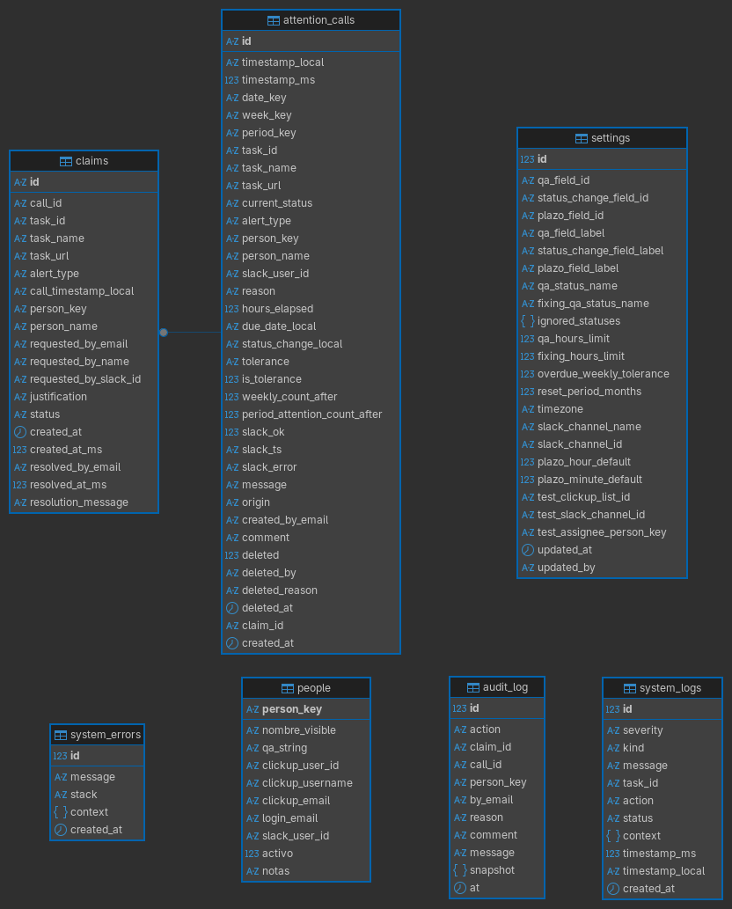

# Llamadas de atencion — ClickUp → Slack (Cloud Run + MySQL)

Sistema de "llamadas de atencion": **API en Cloud Run**, datos de negocio en
**MySQL** y **panel de administracion en Firebase Hosting**. Los roles y el
login del panel usan **Firebase Auth** (custom claims), pero eso es lo unico
que sigue en Firebase — el almacenamiento de negocio es MySQL.

Reemplaza los dos sistemas del Apps Script original:

1. **Llamadas de atencion.** Cuando una tarea de ClickUp se atrasa (QA/FIXING QA
   con mas de 36 h, o vencimiento de plazo), se envia una alerta a Slack. Aplica
   tolerancia semanal (los primeros N son avisos; luego, llamada formal) y lleva
   un contador trimestral de llamadas formales por persona.
2. **Validador de plazo (`validateDueTime`).** Marca un checkbox en ClickUp cuando
   el vencimiento tiene una hora personalizada (distinta de la hora default).

## Estructura

```
src/            API (TypeScript, Express)
  domain/       logica pura y testeable (reglas, tiempo, tolerancia, parsing)
  services/     clickup, slack, people, attention (transaccion), validateDueTime
  webhooks/     endpoints que recibe ClickUp
  admin/        API del panel (auth + roles)
  db.ts         conexion y transacciones MySQL (mysql2/promise)
  firebase.ts   firebase-admin, SOLO para Auth (roles del panel)
db/             schema.sql (esquema MySQL)
  docker/       docker-compose.yml: MySQL local con TLS (certs de prueba) para
                desarrollo/tests contra una conexion cifrada real
scripts/        seed.ts, set-claims.ts, migrate.ts, setup-scheduler.sh
seeds/          people.json (equipo), config.json (defaults)
test/           unit / integration / e2e / smoke (contra MySQL)
web/            panel de administracion (React + Vite + Firebase Auth)
Dockerfile      imagen para Cloud Run
firebase.json   Hosting con rewrite /api → Cloud Run
.github/        workflows/deploy.yml (CI + deploy), workflows/smoke.yml
```

## Requisitos

- Node 20+
- Una cuenta de Google Cloud / Firebase con facturacion habilitada (Cloud Run +
  Firebase Auth + Hosting)
- Un servidor MySQL 8+ accesible (puede vivir fuera de GCP)
- `gcloud` y `firebase-tools` (`npm i -g firebase-tools`)

## Puesta en marcha (una sola vez)

### 1. Proyecto Firebase (Auth + Hosting)

```bash
# Elige tu proyecto
gcloud config set project TU_PROJECT_ID

# Habilita APIs
gcloud services enable run.googleapis.com secretmanager.googleapis.com \
  cloudbuild.googleapis.com
```

Copia `.firebaserc.example` a `.firebaserc` y pon tu `PROJECT_ID`. Habilita
**Google** como metodo de sign-in en Firebase Console → Authentication.

### 2. Servidor MySQL externo (docker-compose + TLS)

La base vive fuera de GCP, en un servidor propio. Estos pasos lo dejan listo
usando el `docker-compose.yml` de `db/docker/` (MySQL con TLS obligatorio).

1. Conectate al servidor por SSH:

   ```bash
   ssh usuario@tu-servidor
   ```

2. Desde tu maquina, copia la carpeta `db/` del proyecto al servidor (de
   preferencia dentro de una carpeta `clickup-sheriff/`):

   ```bash
   scp -r db/ usuario@tu-servidor:~/clickup-sheriff/db
   ```

3. Ya en el servidor (dentro de `clickup-sheriff/db/docker/certs`), genera la
   CA propia y el certificado de servidor con `generate-certs.sh`:

   ```bash
   cd ~/clickup-sheriff/db/docker/certs
   ./generate-certs.sh tu-servidor.midominio.com   # o la IP/host publico
   ```

4. Genera una contraseña root para MySQL:

   ```bash
   openssl rand -base64 24
   ```

5. Levanta el contenedor con docker compose, pasandole esa contraseña:

   ```bash
   cd ~/clickup-sheriff/db/docker
   MYSQL_ROOT_PASSWORD=la-password-generada docker compose up -d
   ```

6. Con el usuario `root` y esa contraseña, crea DENTRO del contenedor el
   usuario que usara el proyecto para conectarse (no uses `root` en la app):

   ```bash
   docker exec -it llamadas-atencion-mysql mysql -uroot -p
   ```

   ```sql
   CREATE USER 'llamadas_app'@'%' IDENTIFIED BY 'otra-password-fuerte';
   GRANT ALL PRIVILEGES ON llamadas_atencion.* TO 'llamadas_app'@'%';
   FLUSH PRIVILEGES;
   ```

7. Aplica el esquema (`db/schema.sql`) usando ese usuario. El puerto expuesto
   por docker-compose es `3307`, y como el servidor exige TLS hay que pasar
   `MYSQL_SSL=true` y el `ca.pem` generado en el paso 3:

   ```bash
   MYSQL_HOST=tu-servidor MYSQL_PORT=3307 MYSQL_USER=llamadas_app MYSQL_PASSWORD=otra-password-fuerte \
   MYSQL_DATABASE=llamadas_atencion MYSQL_SSL=true \
   MYSQL_SSL_CA="$(cat db/docker/certs/ca.pem)" \
   npm run db:migrate
   ```

### 3. Base de datos MySQL

Si tu MySQL no es el del paso anterior (por ejemplo, un proveedor administrado),
crea la base y aplica el esquema (`db/schema.sql`):

```bash
MYSQL_HOST=... MYSQL_PORT=3306 MYSQL_USER=... MYSQL_PASSWORD=... \
MYSQL_DATABASE=llamadas_atencion npm run db:migrate
```

En produccion, la conexion sale por internet publico si la base no esta en una
VPC de GCP: define `MYSQL_SSL=true` y `MYSQL_SSL_CA` (el PEM del certificado
CA del servidor) — ver `src/db.ts` y `.env.example` para el detalle.

### 4. Secretos en Secret Manager

Estos valores nunca van al codigo ni al panel. **Rota los tokens que estaban
en el Apps Script viejo** (estuvieron en texto plano): genera un token nuevo de
ClickUp y reinstala/rota el bot token de Slack.

```bash
printf '%s' 'pk_TU_TOKEN_NUEVO_CLICKUP'  | gcloud secrets create CLICKUP_TOKEN   --data-file=-
printf '%s' 'xoxb-TU_TOKEN_NUEVO_SLACK'  | gcloud secrets create SLACK_BOT_TOKEN --data-file=-
printf '%s' 'un-secreto-largo-y-random'  | gcloud secrets create WEBHOOK_SECRET  --data-file=-
printf '%s' 'la-password-de-mysql'       | gcloud secrets create MYSQL_PASSWORD --data-file=-
# Si usas MYSQL_SSL=true, tambien el certificado CA del servidor:
gcloud secrets create MYSQL_SSL_CA --data-file=./ca.pem
```

El bot de Slack necesita los scopes `chat:write` y `channels:read`
(y `groups:read` si el canal es privado), y debe estar invitado al canal.

### 5. Usuarios y roles del panel

El login del panel es con **Google** (boton "Ingresar con Google"). Para habilitar
un correo:

1. En Firebase Console → Authentication → Sign-in method, activa **Google**.
2. Agrega el correo a la allowlist del servicio (`ADMIN_EMAILS`, separado por coma).
3. Asigna el rol con custom claims:

```bash
export FIREBASE_PROJECT_ID=TU_PROJECT_ID
export GOOGLE_APPLICATION_CREDENTIALS=./serviceAccount.json  # clave con permiso sobre Auth

npm run set-claims -- jefe@empresa.com   superadmin
npm run set-claims -- miembro@empresa.com admin
```

Dos roles:

- **admin** (miembro del equipo): ve **solo sus** llamadas de atencion (vinculadas
  por su correo de Google = `login_email` en la tabla de personas), con filtros;
  puede **solicitar la anulacion** de una llamada con una justificacion; ve el
  estado de sus reclamos y sus estadisticas.
- **superadmin**: revisa y resuelve reclamos (aceptar = anula la llamada
  automaticamente; rechazar con mensaje), ve la salud del sistema (logs),
  estadisticas globales y por persona, gestiona personas y configuracion, y puede
  lanzar la verificacion en vivo.

Para que un admin vea sus llamadas, su **correo de Google** debe estar en la
persona correspondiente (campo _Correo de Google_ en Personas).

### 6. Seed (opcional)

El sistema arranca con base vacia usando defaults. Si quieres precargar el equipo
y la config inicial:

```bash
# contra MySQL real (usa las mismas MYSQL_* del entorno)
npm run seed

# solo personas / solo config
npm run seed -- --people-only
npm run seed -- --config-only --force
```

Tras el seed, completa desde el panel de **Configuracion** los **IDs** de los
campos personalizados de ClickUp (REVISOR, cambio de estado, plazo) y los recursos
de prueba para la verificacion en vivo (lista de ClickUp y canal de Slack).

## Despliegue continuo (GitHub)

El workflow `.github/workflows/deploy.yml` corre tests en cada push/PR y despliega
al hacer push a `main`.

Configura en el repo (Settings → Secrets and variables → Actions):

**Secrets**

- `GCP_PROJECT_ID`
- `WIF_PROVIDER` y `WIF_SERVICE_ACCOUNT` (Workload Identity Federation, recomendado;
  ver la guia de `google-github-actions/auth`). Alternativa: usar una clave JSON.

**Variables**

- `ADMIN_EMAILS` (correos admin separados por coma)
- `MYSQL_HOST`, `MYSQL_PORT`, `MYSQL_USER`, `MYSQL_DATABASE` (la password y el
  CA de TLS van como secretos de Secret Manager, ver mas arriba)
- `VITE_FIREBASE_API_KEY`, `VITE_FIREBASE_AUTH_DOMAIN`, `VITE_FIREBASE_PROJECT_ID`,
  `VITE_FIREBASE_APP_ID` (config publica del cliente Firebase)

Cada push a `main` reconstruye la API (Cloud Run leyendo los secretos de Secret
Manager) y redepliega el panel en Hosting.

## Despliegue manual (alternativa)

```bash
# API
gcloud run deploy llamadas-atencion-api \
  --source . --region us-central1 --allow-unauthenticated \
  --set-env-vars FIREBASE_PROJECT_ID=TU_PROJECT_ID,ADMIN_EMAILS=jefe@empresa.com,MYSQL_HOST=TU_HOST,MYSQL_PORT=3306,MYSQL_USER=TU_USER,MYSQL_DATABASE=llamadas_atencion,MYSQL_SSL=true \
  --set-secrets CLICKUP_TOKEN=CLICKUP_TOKEN:latest,SLACK_BOT_TOKEN=SLACK_BOT_TOKEN:latest,WEBHOOK_SECRET=WEBHOOK_SECRET:latest,MYSQL_PASSWORD=MYSQL_PASSWORD:latest,MYSQL_SSL_CA=MYSQL_SSL_CA:latest

# Panel
cd web && npm ci && npm run build && cd ..
firebase deploy --only hosting --project TU_PROJECT_ID
```

## Conectar ClickUp

### 1. Obten la URL real del servicio de Cloud Run

Los webhooks van **directo a Cloud Run**, no a Firebase Hosting (Hosting solo
reescribe `/api/**` hacia Cloud Run para el panel; `/webhooks/**` no pasa por ahi,
asi que usar el dominio de Hosting para el webhook da 404).

```bash
gcloud run services describe llamadas-atencion-api \
  --region us-central1 --format='value(status.url)'
```

Eso imprime algo como `https://llamadas-atencion-api-xxxxxxxx-uc.a.run.app`. La URL
completa del webhook de llamadas de atencion es esa mas `/webhooks/clickup`.

### 2. Configura el webhook en ClickUp (Automate → Webhooks → Create webhook)

La configuracion es simple: ya no hace falta mandar `task_id`, `assignees`,
`task_link`, `task_name`, `status_name` ni `due_date_text` como parametros de URL.

- El webhook es **solo un disparador**: el backend ignora cualquier dato de estado
  que traiga y siempre vuelve a consultar la tarea fresca a la API de ClickUp (ver
  seccion siguiente). Solo necesita saber que tarea revisar.
- ClickUp's action **Call webhook** siempre manda un cuerpo JSON con `payload.id`
  (el id de la tarea), sin que haya que configurar nada extra. El backend ya lo lee
  de ahi automaticamente.
- Los "Url Parameters" de ClickUp son **estaticos** (la documentacion oficial lo
  dice explicitamente: _"Unlike the dynamic variables, URL parameters are
  static"_), y el selector actual de variables dinamicas de ClickUp solo ofrece
  Task ID, Task Name, Task Description, Creator Username, Creator Email, Due Date,
  Start Date, Date Created, Date Updated y Date Closed — **no** incluye
  `assignees`, `status` ni `task_link`. Si tu configuracion anterior usaba
  placeholders como `{assignees}` o `{status_status}` en los Url Parameters, es
  probable que ya no se sustituyan y se envien como texto literal. Como el sistema
  nuevo no los necesita, la solucion es simplemente quitarlos.

**Configuracion recomendada:**

| Campo                                                   | Valor                                                                                                           |
| ------------------------------------------------------- | --------------------------------------------------------------------------------------------------------------- |
| URL                                                     | `https://<tu-servicio>.run.app/webhooks/clickup` (sin nada mas)                                                 |
| Casillas de campos dinamicos (Task ID, Task Name, etc.) | Ninguna marcada — no hacen falta                                                                                |
| Headers                                                 | `Content-type: application/json` (por defecto) + opcional `X-Webhook-Secret: EL_WEBHOOK_SECRET` (ver mas abajo) |
| Url Parameters                                          | `action` = `attentionCheck` (y si no usas el header, tambien `secret` = `EL_WEBHOOK_SECRET`)                    |

Para el **validador de plazo**, la misma URL pero **sin** el parametro `action`
(o con cualquier valor distinto de `attentionCheck`).

### 3. Como se manda el secret: header (recomendado) o URL

El sistema acepta el `WEBHOOK_SECRET` de dos formas:

- **Header `X-Webhook-Secret`** (recomendado). ClickUp trata los valores de
  headers como sensibles: una vez guardados, no se pueden volver a ver ni editar
  en claro, a diferencia de los Url Parameters que quedan visibles en la
  configuracion del webhook. Agregalo en la seccion **Headers** con clave
  `X-Webhook-Secret` (usa **Add** para headers personalizados).
- **Parametro `secret` en la URL** (compatibilidad con configuraciones previas).
  Sigue funcionando, pero queda visible en la pantalla de configuracion.

Si usas el header, no hace falta el parametro `secret` en la URL (y viceversa). Si
mandas ambos, se usa el header.

> ⚠️ Si alguna vez tu `WEBHOOK_SECRET` quedo expuesto en texto plano (por ejemplo,
> compartido fuera de un canal seguro), **rotalo**: genera un valor nuevo, actualizalo
> en Secret Manager y en la configuracion del webhook en ClickUp al mismo tiempo.

Manten los mismos triggers/horarios que ya tenias configurados en las
automatizaciones (Schedule, condiciones de estado, etc.) — lo unico que cambia es
la URL, los headers y los parametros del webhook en si.

### El webhook es solo un disparador (verificacion de estado)

El sistema **no confia en el estado que trae el webhook**. ClickUp puede mandar el
webhook con retraso (los reintentos duran hasta **1 hora y 15 minutos** segun la
documentacion oficial), reintentarlo, o dispararlo cuando la tarea ya cambio de
estado (por ejemplo, cuando ya paso a **PRODUCTION**). Por eso, al recibir un
webhook de `attentionCheck`, el sistema toma unicamente el `task_id` y **vuelve a
consultar el estado actual de la tarea a la API de ClickUp**, y evalua las reglas
contra ese estado fresco:

- Si la tarea ya esta en **PRODUCTION** (u otro estado terminal), no se emite nada.
- Si ya no cumple la regla de 36 h (porque cambio de estado y el reloj se reinicio),
  no se emite nada.
- Si no se puede verificar el estado (falla la API de ClickUp), **tampoco se emite**:
  se prefiere no alertar antes que emitir una llamada de atencion sobre datos sin
  confirmar.

Los estados terminales que nunca generan alerta se configuran en
`ignoredStatuses` (por defecto `production, done, closed, completado`) y se pueden
ajustar desde el panel de configuracion.

### Campo del revisor (REVISOR)

El revisor de una tarea se lee de un **campo personalizado** de ClickUp. Su nombre
es configurable en el panel (Configuracion → _Campo del revisor_), en el ajuste
`qaFieldName` (por defecto `REVISOR`). Es distinto del **estado** `QA`
(`qaStatusName`): el estado se sigue llamando QA; lo que cambio de nombre fue el
campo del revisor. Si renombras el campo en ClickUp, basta con actualizarlo en el
panel; no hay que tocar codigo.

## Desarrollo local

Si no tienes un MySQL local a mano, `db/docker/docker-compose.yml` levanta uno
con TLS ya configurado (puerto `3307`), util para probar el flujo
`MYSQL_SSL=true` sin depender de un servidor externo. Los certificados no
estan versionados: generalos primero con `db/docker/certs/generate-certs.sh`
(crea una CA propia y un certificado de servidor firmado por ella):

```bash
./db/docker/certs/generate-certs.sh localhost   # o el host que uses
MYSQL_ROOT_PASSWORD=lo-que-quieras docker compose -f db/docker/docker-compose.yml up -d
```

```bash
# API + MySQL local
npm install
cp .env.example .env   # completa MYSQL_* y el resto de variables
npm run db:migrate     # aplica db/schema.sql contra tu MySQL local
npm run dev

# Panel
cd web && npm install && cp .env.example .env   # completa los VITE_*
npm run dev   # proxy de /api hacia localhost:8080
```

## Tests

Los tests de integracion/e2e usan la misma base MySQL configurada por
`MYSQL_*` (`test/helpers.ts` trunca todas las tablas antes de cada test) — se
recomienda una base/schema **dedicado para tests**, nunca el de produccion (los git actions ejecutan los tests en una base de datos de prueba que se borra al terminar el job).

En el proyecto se tiene el archivo docker-compose.test.yml, para levantar un servicio mysql local para ejecutar las pruebas en desarrollo.

```bash
docker compose -f db/docker/docker-compose.test.yml up -d
```

El comando de ejecución de los test debe comenzar declarando las variables de conexión con el servicio de mysql

```bash
MYSQL_HOST=127.0.0.1 MYSQL_PORT=3308 MYSQL_USER=root MYSQL_PASSWORD=test \
MYSQL_DATABASE=llamadas_atencion_test MYSQL_SSL=false npm run test:<tipo>
```

Comandos disponibles

```bash
npm run test:unit          # logica pura, sin dependencias externas
npm run test:integration   # idempotencia, contadores y re-emision (requiere MySQL)
npm run test:e2e           # webhook completo por HTTP (requiere MySQL)
```


Entre los flujos verificados estan los dos que mas facilmente fallan:

- **Idempotencia** y **contadores** consistentes bajo rafagas concurrentes.
- **Re-emision tras borrado**: si una llamada fue eliminada (por error o por un
  test) y la condicion sigue vigente el mismo dia, un nuevo webhook la vuelve a
  emitir y a enviar a Slack (no se queda bloqueada por la fila eliminada).

### Smoke tests en vivo (base y URLs reales)

Para verificar el sistema **ya desplegado**, contra ClickUp real, MySQL real y
Slack real, hay una suite aparte que no corre por defecto:

```bash
# Verificacion SEGURA (dry-run: no escribe en MySQL ni postea a Slack).
# Hace el fetch real de la tarea a ClickUp y evalua las reglas.
SMOKE_API_URL=https://<tu-servicio>.run.app \
SMOKE_WEBHOOK_SECRET=<tu-secret> \
SMOKE_TASK_ID=<id-de-tarea-real> \
npm run test:smoke

# Verificacion COMPLETA (ESCRIBE en MySQL y postea a Slack de verdad):
# incluye el flujo de re-emision tras borrado y limpia la fila al final.
... SMOKE_ALLOW_WRITES=1 MYSQL_HOST=... MYSQL_PORT=... MYSQL_USER=... MYSQL_PASSWORD=... MYSQL_DATABASE=... npm run test:smoke
```

El modo dry-run tambien esta disponible como endpoint, agregando `&dryRun=1` al
webhook de `attentionCheck`: devuelve que pasaria (si ameritaria llamada, a quien,
que tolerancia) sin ningun efecto. Hay ademas un workflow manual en GitHub Actions
(`Smoke (en vivo)`) que corre el dry-run contra el servicio desplegado.

## Modelo de datos (MySQL, ver `db/schema.sql`)



- `attention_calls` — es la tabla principal, cada registro es una llamada de atención sobre una tarea en ClickUp. Cada llamada de atencion (idempotente por `id =
  {fecha}_{taskId}_{tipo}`). Guarda la hora exacta (`timestamp_ms` +
  `timestamp_local`), el `period_key` del periodo de reinicio, el contador
  `period_attention_count_after`, y el estado de anulacion (`deleted`,
  `deleted_by`, `deleted_reason`, `claim_id`).
- `people` — La plantilla del equipo. une las identidades ClickUp, Slack y Firebase Auth con una clave interna que no tiene una relación directa (foreign key) con el resto de tablas. Esto porque el sistema genera valores sintéticos de person_key para tareas de clickup sin persona asignada. Esta tabla también Incluye `login_email` (correo de Google con el que
  inicia sesion el admin).
- `settings` — fila unica (`id = 1`) con los parametros editables desde el
  panel. Los campos de ClickUp se referencian por **ID** (`qa_field_id`,
  `status_change_field_id`, `plazo_field_id`); `reset_period_months` define
  cada cuantos meses se reinician los contadores.
- `claims` — Solicitud de un administrador (ese es el rol para los usuarios que reciben las llamadas de atención) para anular una de sus propias llamadas. Cuenta con el estado (pendiente / aceptado / rechazado), con
  justificacion, quien lo pide y la respuesta del superadmin. Sólo se permite un reclamo abierto (pendiente/aceptado) por llamada.
- `system_logs` — eventos de salud del sistema. Todo webhook deberia terminar
  en llamada; si no (ignorado, sin alerta, error, fallo al consultar ClickUp)
  queda registrado aqui con severidad (`info`/`warn`/`error`).
- `audit_log` — acciones sensibles (anulaciones manuales, reclamos resueltos).
- `system_errors` — Diagnóstico de errores separado de system_logs. Los registros se escriben desde logSystemError() en la ruta del webhook.

Relaciones directas/indirectas de las tablas:

```
people (person_key) ──(informal, no FK)──> attention_calls.person_key
                     ──(informal, no FK)──> claims.person_key
                     ──(informal, no FK)──> audit_log.person_key

attention_calls (id) ──(real FK)──> claims.call_id
                      <──(informal, id stored)── attention_calls.claim_id (denormalized back-pointer)

claims (id) ──(informal, no FK)──> audit_log.claim_id
attention_calls (id) ──(informal, no FK)──> audit_log.call_id

settings: standalone, single row (id=1)
system_logs / system_errors: standalone, no relations
```

Propiedades de las tablas que apuntan a IDs de servicios de terceros
- `task_id`: ID de una tarea de ClickUp
- `clickup_user_id, clickup_username, clickup_email`: Usuario de ClickUp
- `slack_user_id`: Usuario de Slack
- `slackChannelName, slackChannelId`: Info del canal de Slack

El cliente nunca accede a MySQL directo: la base no es alcanzable desde el
panel y todo pasa por la API. Los roles/permisos del panel siguen viviendo en
Firebase Auth (custom claims), independiente del almacenamiento de negocio.

## Verificacion en vivo (realista) y cronjob

Ademas del dry-run, el sistema puede hacer una prueba **realista** de la cadena
completa contra ClickUp y Slack **reales**, usando una lista de ClickUp y un canal
de Slack **dedicados de prueba** (configurables en el panel de Configuracion):

1. Crea una tarea de prueba vencida en la lista de prueba.
2. Ejecuta la evaluacion (misma logica que un webhook) posteando al canal de prueba.
3. Verifica que se genero la llamada y que Slack respondio ok.
4. **Limpia** todo: borra el mensaje de Slack, la tarea de ClickUp y la fila
   en MySQL.

Se ejecuta de tres formas:

- **En cada despliegue**: el workflow llama a `/internal/live-verify` tras el deploy
  y **falla el despliegue** si la cadena no funciona.
- **Diariamente**: un job de Cloud Scheduler llama al mismo endpoint (ver
  `scripts/setup-scheduler.sh`).
- **A demanda**: boton "Verificacion en vivo" en el panel de Salud del sistema.

El endpoint `/internal/live-verify` esta protegido por `WEBHOOK_SECRET` (header
`X-Webhook-Secret`), no por login, para que Cloud Scheduler pueda invocarlo.

## Llamada de atencion manual (superadmin)

Ademas de las llamadas automaticas por webhook, el superadmin puede registrar una
llamada **manual** desde el panel (menu "Llamada manual"). Elige una persona del
equipo, escribe una razon y, opcionalmente, un comentario. La llamada:

- sigue el **mismo procedimiento** que las automaticas: se envia a Slack, cuenta
  como aviso de tolerancia o llamada formal segun la semana, y suma al contador
  del periodo;
- se registra con el tipo `MANUAL`, la **hora exacta** y el correo del superadmin
  que la creo (`created_by_email`), ademas de `origin: 'manual'` y el `comment`;
- queda en `audit_log` (accion `manual_call`) y en `system_logs` (kind
  `manual_raised`).

A diferencia del flujo por webhook, cada llamada manual es intencional y unica: no
hay idempotencia por tarea/dia, se genera un id propio (`manual_{ms}_{persona}_...`).
Endpoint: `POST /api/admin/manual-calls` (solo superadmin).

## Seguridad

- Tokens y credenciales de MySQL en Secret Manager, nunca en el codigo ni en la base.
- Trafico a MySQL cifrado con TLS (`MYSQL_SSL=true`) cuando la base vive fuera de GCP.
- Webhooks e endpoints internos protegidos por `WEBHOOK_SECRET`.
- Panel protegido por login de Google (ID token de Firebase) + allowlist de correos
  (`ADMIN_EMAILS`) + roles por custom claims (`admin` / `superadmin`).
- Un admin solo puede ver y reclamar **sus propias** llamadas.
